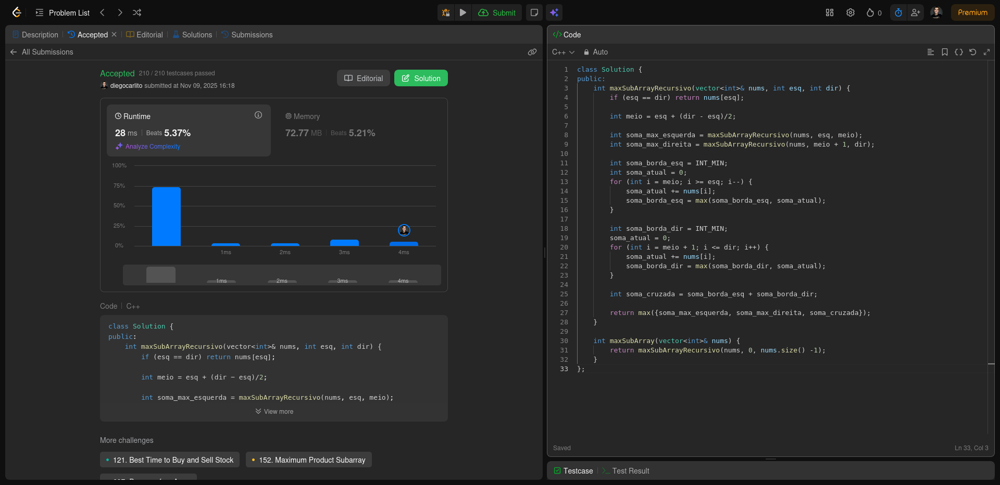
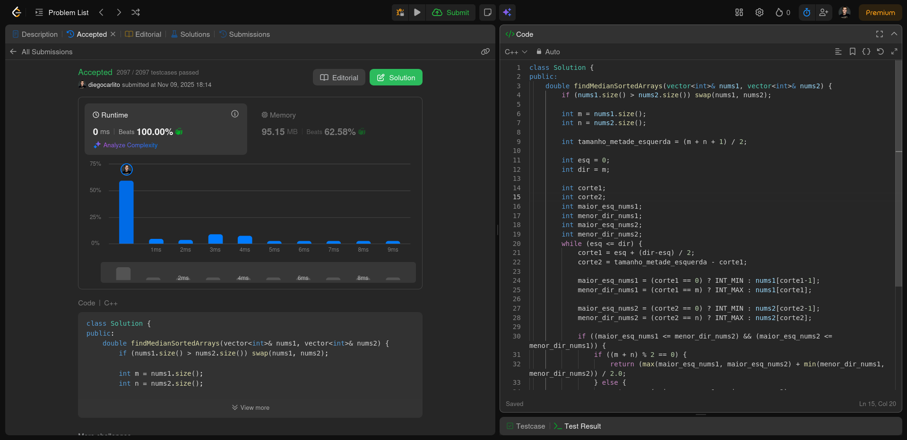
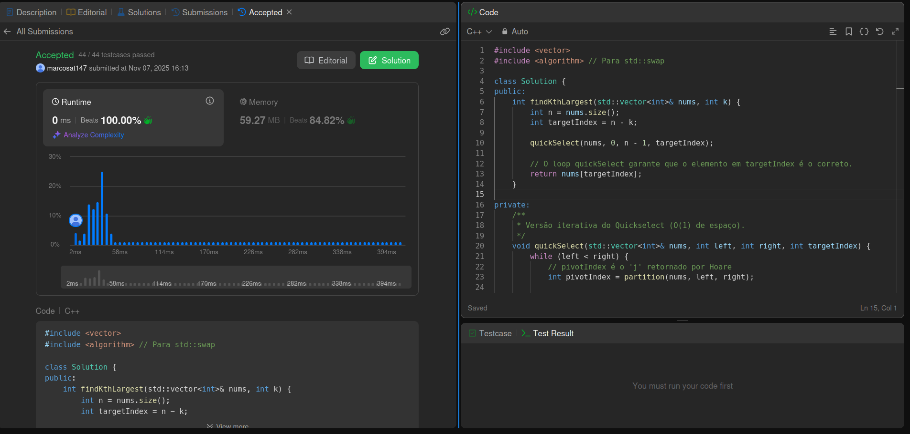
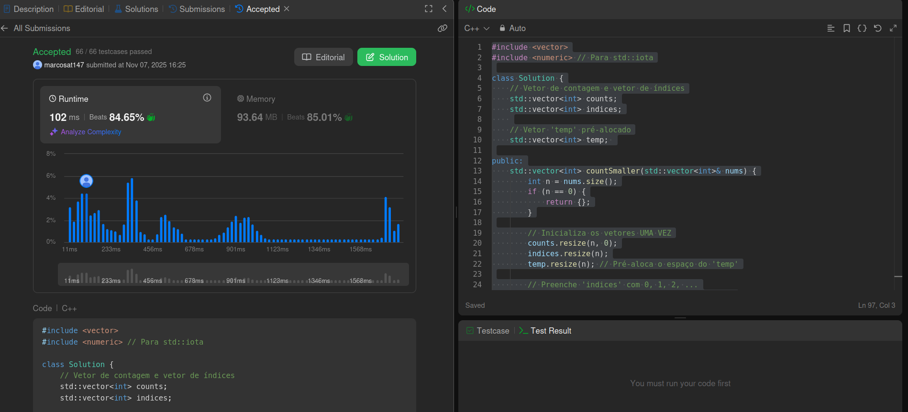

# DivideAndConquer_LeetCode-D17

**Número da Lista**: 4 
**Conteúdo da Disciplina**: Dividir para Conquistar 

## Alunos
|Matrícula | Aluno |
| -- | -- |
| 22/1007690  |  Diego Carlito Rodrigues de Souza  |
| 22/1008300  |  Marcos Antonio Teles de Castilhos |

## Sobre 
O projeto possui como tema central a resolução de exercícios de programação competitiva com o tema de Dividir para Conquistar, utilizando a plataforma de juiz online LeetCode.

## Exercícios

| Exercício | Nível  | Vídeo Explicando |
|---------|--------|------------------|
| [215. Kth Largest Element in an Array](https://leetcode.com/problems/kth-largest-element-in-an-array/description/) | Médio |[2:54](https://youtu.be/QOTON7rVSx8?si=tv5kZK5yDy1pnV7t&t=174) | 
| [53. Maximum Subarray](https://leetcode.com/problems/maximum-subarray/description/) | Médio | [00:00](https://youtu.be/QOTON7rVSx8) |
| [4. Median of Two Sorted Arrays](https://leetcode.com/problems/median-of-two-sorted-arrays/description/) | Difícil | [1:20](https://youtu.be/QOTON7rVSx8?si=3TtxQdd7NWurNVhY&t=80) |
| [315. Count of Smaller Numbers After Self](https://leetcode.com/problems/count-of-smaller-numbers-after-self/description/) | Difícil | [6:13](https://youtu.be/QOTON7rVSx8?si=YIjQAYRPiMJanuQx&t=373) |

[Vídeo explicando todos os exercícios](https://youtu.be/QOTON7rVSx8)

## Screenshots

### Exercício 01 - [53. Maximum Subarray](https://github.com/projeto-de-algoritmos-2025/DivideAndConquer_LeetCode-D17/blob/master/53_Maximum_Subarray/solution.cpp) - Médio

  
   
  <a href="https://leetcode.com/problems/maximum-subarray/submissions/1825398176/">
    Visualizar submissão do exercício 53
  </a>

### Exercício 02 - [4. Median of Two Sorted Arrays](https://github.com/projeto-de-algoritmos-2025/DivideAndConquer_LeetCode-D17/blob/master/4_Median_of_Two_Sorted_Arrays/solution.cpp) - Difícil

  
   
  <a href="https://leetcode.com/problems/median-of-two-sorted-arrays/submissions/1825460722/">
    Visualizar submissão do exercício 4
  </a>

### Exercício 03 - [215. Kth Largest Element in an Array](https://leetcode.com/problems/kth-largest-element-in-an-array/description/) - Médio

  
   
  <a href="https://leetcode.com/problems/kth-largest-element-in-an-array/submissions/1823409919/">
    Visualizar submissão do exercício
  </a>

### Exercício 04 - [315. Count of Smaller Numbers After Self](https://leetcode.com/problems/count-of-smaller-numbers-after-self/description/) - Difícil 

  
   
  <a href="https://leetcode.com/problems/count-of-smaller-numbers-after-self/submissions/1823419301/">
    Visualizar submissão do exercício
  </a>

## Instalação 
**Linguagem**: C++ 

## Verificação

Para validar se a solução implementada está correta, submeta o código no **[LeetCode](https://leetcode.com/)** e verifique se o exercício foi aceito. Cada solução contém o link para a descrição completa do problema no próprio código-fonte.
